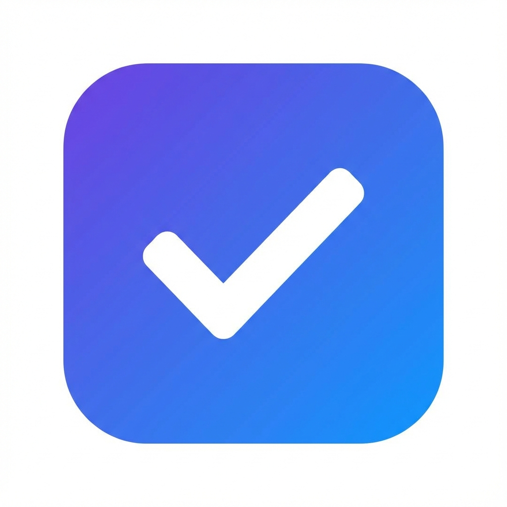
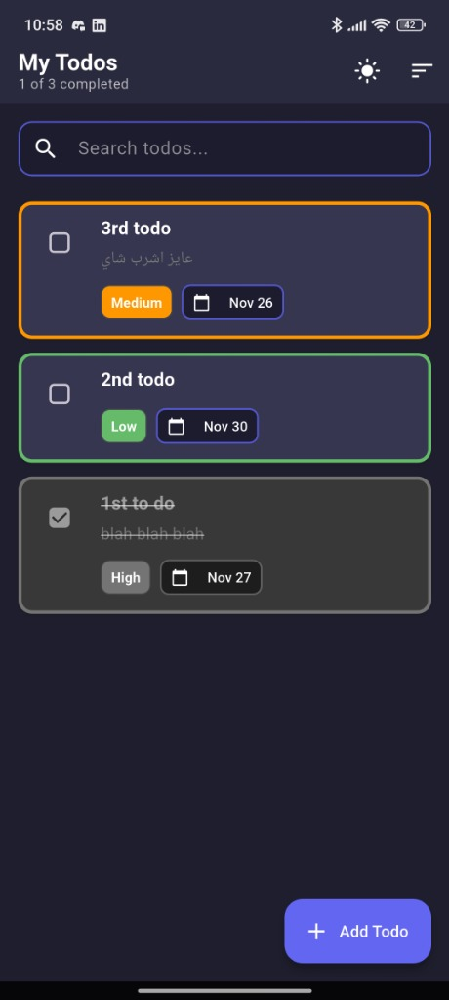
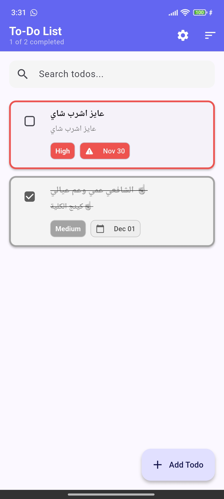

# Todo List App

<div align="center">
  
  
  **A modern, feature-rich To-Do List application built with Flutter**
  
  [](https://flutter.dev)
  [](https://dart.dev)
  [](https://m3.material.io)
</div>

---

## ✨ Features

- ✅ **CRUD Operations**: Create, read, update, and delete tasks
- 🎨 **Material Design 3**: Modern UI with dynamic theming
- 🌓 **Dark/Light Mode**: Seamless theme switching with persistent preferences
- 📅 **Due Dates**: Set and manage task deadlines
- 🏷️ **Priority Levels**: Organize tasks by High, Medium, or Low priority
- 🔍 **Search Functionality**: Quickly find tasks with real-time search
- 💾 **Local Storage**: Persistent data using SharedPreferences
- 📱 **Responsive Design**: Optimized for various screen sizes
- ⚡ **Smooth Animations**: Polished transitions and interactions

## 🛠️ Tech Stack

- **Framework**: Flutter 3.9.2
- **Language**: Dart 3.9.2
- **State Management**: Provider
- **Local Storage**: SharedPreferences
- **UI Components**: Material Design 3
- **Typography**: Google Fonts
- **Date Handling**: intl package

## 📸 Screenshots

<div align="center">
  
  
  <p><i>Dark mode and Light mode with task list showing different priority levels</i></p>

</div>

## 🚀 Getting Started

### Prerequisites

- Flutter SDK (3.9.2 or higher)
- Dart SDK (3.9.2 or higher)
- Android Studio / VS Code
- An Android emulator or physical device

### Installation

1. **Clone the repository**

   ```bash
   git clone <repo_url>
   cd To-Do-Flutter-App
   ```

2. **Install dependencies**

   ```bash
   flutter pub get
   ```

3. **Run the app**

   ```bash
   flutter run
   ```

### Building Release APK

To build a release APK for Android:

```bash
flutter build apk --release
```

The APK will be located at:

```
build/app/outputs/flutter-apk/app-release.apk
```

## 📂 Project Structure

```
lib/
├── main.dart                 # Application entry point
├── models/
│   ├── todo.dart            # Todo data model
│   └── priority.dart        # Priority enum and extensions
├── screens/
│   └── todo_list_screen.dart # Main todo list screen
├── services/
│   ├── todo_storage.dart    # Local storage service
│   └── theme_service.dart   # Theme management service
└── widgets/
    ├── todo_item_widget.dart # Individual todo item
    └── add_todo_dialog.dart  # Add/Edit todo dialog
```

## 🎯 Usage

1. **Create a Task**: Tap the floating action button (+) to add a new task
2. **Set Priority**: Choose from High, Medium, or Low priority levels
3. **Add Due Date**: Optionally set a deadline for your task
4. **Mark Complete**: Tap the checkbox to mark tasks as done
5. **Edit Task**: Tap on a task card to edit its details
6. **Delete Task**: Swipe left or use the delete icon
7. **Search**: Use the search bar to filter tasks
8. **Toggle Theme**: Tap the theme icon to switch between light and dark mode

## 📦 Dependencies

| Package | Version | Purpose |
|---------|---------|---------|
| `provider` | ^6.1.1 | State management |
| `shared_preferences` | ^2.2.2 | Local data persistence |
| `google_fonts` | ^6.1.0 | Custom typography |
| `intl` | ^0.19.0 | Date formatting |
| `uuid` | ^4.3.3 | Unique ID generation |
| `cupertino_icons` | ^1.0.8 | iOS-style icons |

## 🤝 Contributing

Contributions are welcome! Please feel free to submit a Pull Request.

## 📄 License

This project is licensed under the MIT License - see the LICENSE file for details.

## 👨‍💻 Author

**Mohamed Ramadan**

- GitHub: [@mohamed-ramadan-me](https://github.com/mohamed-ramadan-me)
- Email: <m.ramadan.tech@gmail.com>

---

<div align="center">
  Made with ❤️ using Flutter
</div>
